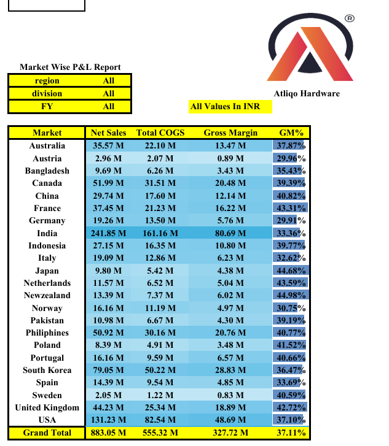
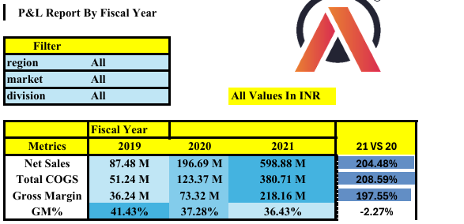
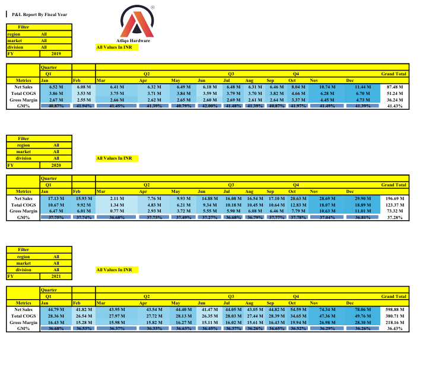

# Financial Performance Analysis Dashboard using Excel

## Project Overview

Developed an interactive Excel-based financial analytics dashboard to analyze sales performance, profitability trends, and financial health across markets and fiscal years.

The dashboard provides stakeholders with a centralized view of key financial KPIs to support data-driven decision-making and strategic planning.

---

## Business Problem

Business leaders needed a consolidated reporting solution to:

- Monitor financial performance across different markets.
- Evaluate profitability trends over multiple fiscal years.
- Identify high-performing and underperforming regions.
- Understand the relationship between revenue growth and profitability.
- Support strategic decisions through actionable financial insights.

---

## Project Objective

The objective of this project was to develop an interactive financial analytics dashboard that enables stakeholders to:

- Track financial performance across markets and fiscal years.
- Identify profitability trends and margin fluctuations.
- Improve visibility into critical financial KPIs.
- Support strategic decisions through data-driven insights.
- Highlight areas requiring cost optimization and operational improvements.

---

## Tools & Techniques Used

- **Microsoft Excel**
- **Pivot Tables**
- **Power Query**
- **Pivot Charts**
- **Data Cleaning & Transformation**
- **Financial KPI Analysis**
- **Interactive Dashboard Design**

---

## Key Business Metrics

| Metric | Description |
|---------|-------------|
| Net Sales | Total revenue generated from sales |
| Cost of Goods Sold (COGS) | Direct costs incurred in producing goods sold |
| Gross Margin | Profit remaining after deducting COGS from Net Sales |
| Gross Margin % | Gross Margin expressed as a percentage of Net Sales |
| Year-over-Year Growth % | Growth in financial performance compared to previous fiscal periods |

---

## Dashboard Snapshots

### Market-wise P&L Analysis



---

### Fiscal Year Performance Analysis



---

### Monthly Performance Trend Analysis



---

## Key Insights

### Revenue Growth Analysis

- Net Sales demonstrated consistent growth across fiscal years, indicating successful market expansion and increasing demand.
- Significant revenue acceleration was observed in later fiscal periods, reflecting improved business performance.

### Profitability Analysis

- Gross Margin % declined despite revenue growth, suggesting increasing operational costs or pricing pressures.
- Higher sales volumes alone did not translate into proportional profitability improvements.

### Financial Performance Trends

- Market-level profitability varied considerably, indicating opportunities for targeted regional strategies.
- Certain periods exhibited stronger financial performance, highlighting potential seasonality and demand patterns.

### Strategic Implications

- Sustainable growth requires balancing revenue expansion with effective cost management.
- Profitability metrics should be monitored alongside sales metrics to ensure long-term business health.

---

## Business Recommendations

Based on the analysis, the following actions are recommended:

- Investigate key drivers contributing to declining Gross Margin percentages.
- Optimize procurement and supply chain processes to better control COGS.
- Prioritize investments and expansion efforts in high-margin markets.
- Establish continuous monitoring of profitability KPIs alongside revenue metrics.
- Conduct deeper market-level analyses to identify operational improvement opportunities.

---

## Business Impact

This dashboard enables stakeholders to:

- Monitor financial performance through a centralized reporting solution.
- Identify profitability risks early through KPI tracking.
- Support strategic decision-making using data-driven insights.
- Balance growth objectives with profitability considerations.
- Drive more informed decisions related to expansion and cost optimization.

---

## Repository Structure

```text
excel-sales-finance-analytics/
│
├── README.md
├── screenshots/
│   ├── market_pnl_report.png
│   ├── fiscal_year_pnl.png
│   └── monthly_pnl_analysis.png
│
├── insights/
│   └── business_insights.md
│
└── assets/
    └── dataset_description.md
```

---

## Dashboard Workbook Access

Due to GitHub file size limitations, the complete Excel dashboard workbook is not included in this repository.

The workbook can be shared upon request for learning, portfolio review, or discussion purposes.

Feel free to connect with me via LinkedIn to request access or discuss the analytical approach used in this project.

---

## Key Learnings

Through this project, I strengthened my ability to:

- Translate business requirements into analytical solutions.
- Design executive-level dashboards for financial reporting.
- Derive actionable insights from financial datasets.
- Apply business thinking to analytical outputs.
- Communicate recommendations that support strategic decision-making.

---

## About the Dataset

- **Domain:** Sales & Financial Analytics
- **Dataset Source:** Codebasics Financial Analytics Case Study
- **Analysis Focus:** Revenue Growth, Profitability Trends, and Financial KPI Monitoring

---

## Author

**Souvik Dutta**

Business Analyst | Growth Strategy | SQL | Power BI | Excel

Sales and Analytics professional with 8+ years of experience across FMCG, E-commerce, and Quick Commerce, specializing in leveraging data to drive business growth, operational efficiency, and strategic decision-making.

- GitHub: https://github.com/Iamsouvikdutta
- LinkedIn: https://www.linkedin.com/in/iamsouvikdutta/

---

## Connect With Me

If you have feedback, suggestions, or would like to discuss analytics, business strategy, or data-driven decision-making, feel free to connect.
