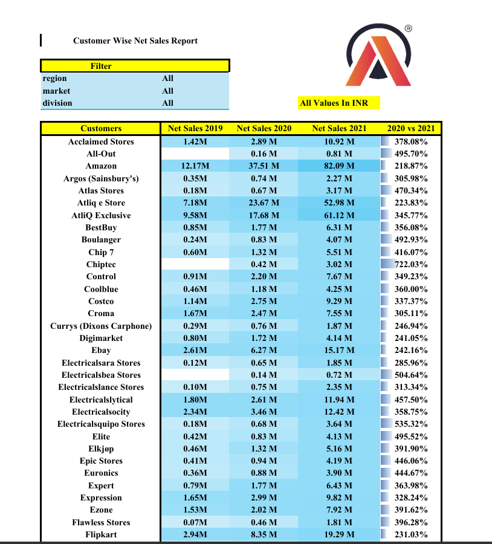
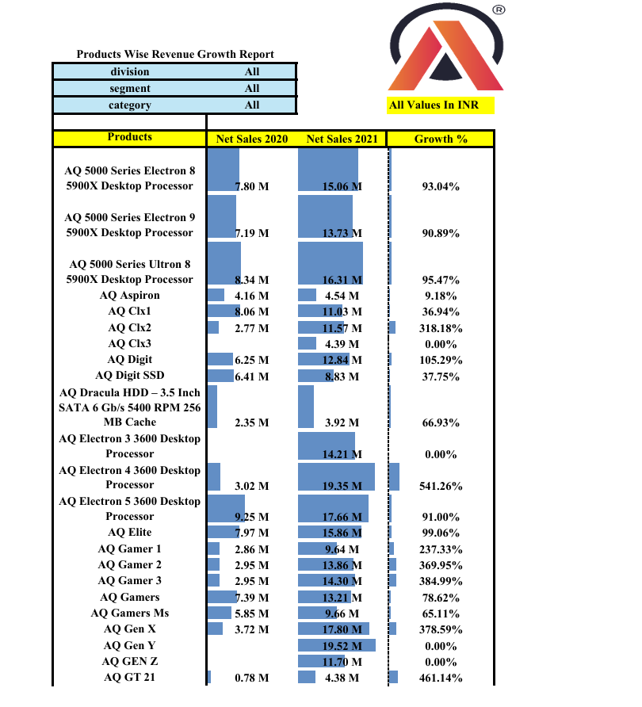
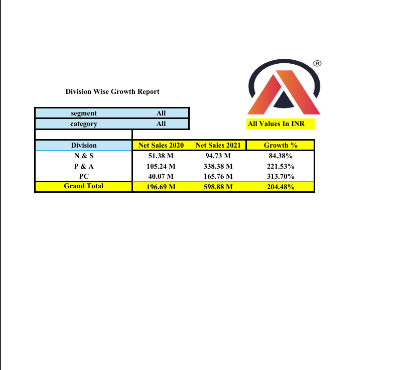
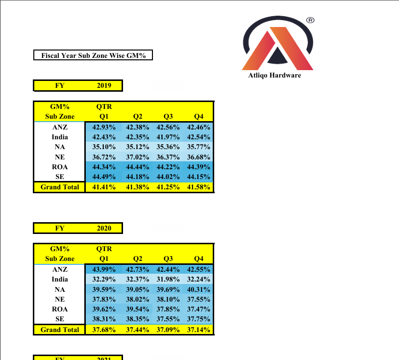

# Financial Performance Analysis Dashboard using Excel

## Project Overview

Developed an interactive Excel-based analytics solution to evaluate sales performance, financial health, and profitability trends across multiple business dimensions. The project provides stakeholders with a centralized reporting framework to monitor key financial KPIs and support data-driven strategic decision-making.

---

## Business Problem

Business leaders required a consolidated reporting solution to:

* Monitor sales and financial performance across markets and divisions.
* Evaluate profitability trends over multiple fiscal periods.
* Identify high-performing customers, products, and regions.
* Understand the relationship between revenue growth and profitability.
* Support strategic planning through actionable business insights.

---

## Project Objective

The objective of this project was to develop a comprehensive business intelligence dashboard that enables stakeholders to:

* Track financial performance across markets and fiscal years.
* Monitor sales trends across customers, products, and regions.
* Identify profitability fluctuations and growth opportunities.
* Improve visibility into critical business KPIs.
* Support strategic decision-making using data-driven insights.

---

## Tools & Techniques Used

* Microsoft Excel
* Power Query
* Pivot Tables
* Pivot Charts
* Data Cleaning & Transformation
* Financial KPI Analysis
* Sales Performance Analysis
* Interactive Dashboard Design

---

## Key Business Metrics

| Metric                    | Description                                                 |
| ------------------------- | ----------------------------------------------------------- |
| Net Sales                 | Total revenue generated from sales                          |
| Cost of Goods Sold (COGS) | Direct costs incurred in producing goods sold               |
| Gross Margin              | Profit remaining after deducting COGS from Net Sales        |
| Gross Margin %            | Gross Margin expressed as a percentage of Net Sales         |
| Year-over-Year Growth %   | Growth in business performance compared to previous periods |

---

## Dashboard Snapshots

### Financial Performance Analysis

#### Market-wise P&L Analysis


#### Fiscal Year Performance Analysis


#### Monthly Performance Trends


---

### Sales Performance Analysis

#### Customer Performance Report



#### Product Performance Report



---

### Growth & Regional Analysis

#### Division Growth Analysis



#### Sub-zone P&L Analysis



---

Additional dashboard reports, including Market Performance and Division Performance analyses, are available within the `screenshots` folder.

---

## Key Insights

### Revenue & Growth Insights

* The business demonstrated consistent revenue growth across fiscal years, indicating successful market expansion.
* Growth rates varied across divisions, highlighting opportunities for targeted strategic initiatives.

### Profitability Insights

* Gross Margin % declined despite increasing revenue, suggesting rising operational costs or pricing pressures.
* Revenue growth alone did not translate into proportional profitability improvements.

### Customer & Product Insights

* Revenue contribution was concentrated among specific customer segments and product categories.
* Product-level analysis identified opportunities to optimize portfolio performance.

### Regional Insights

* Market and sub-zone profitability varied significantly, emphasizing the need for region-specific strategies.
* Certain markets consistently outperformed others across both revenue and margin metrics.

---

## Business Recommendations

Based on the analysis, the following actions are recommended:

* Investigate factors contributing to declining gross margins despite revenue growth.
* Optimize procurement and operational efficiencies to improve profitability.
* Focus investment and expansion efforts on high-margin markets and divisions.
* Strengthen customer retention strategies for high-value customer segments.
* Regularly monitor financial and sales KPIs to support proactive decision-making.

---

## Business Impact

This dashboard enables stakeholders to:

* Monitor business performance through a centralized reporting solution.
* Identify profitability risks early through KPI tracking.
* Support strategic planning using data-driven insights.
* Balance growth objectives with profitability considerations.
* Drive informed decisions related to market expansion and cost optimization.

---

## Repository Structure

```text
excel-sales-finance-analytics/
│
├── README.md
├── screenshots/
│   ├── customer_report.png
│   ├── division_report.png
│   ├── divisiongrowth_report.png
│   ├── fiscal_year_pnl.png
│   ├── market_pnl_report.png
│   ├── market_report.png
│   ├── monthly_pnl_analysis.png
│   ├── product_report.png
│   └── subzone_pnl.png
│
├── insights/
│   └── business_insights.md
│
└── assets/
    └── dataset_description.md
```

---

## Dashboard Workbook Access

Due to GitHub file size limitations, the complete Excel dashboard workbook is not included in this repository.

The workbook can be shared upon request for learning, portfolio review, or discussion purposes.

Please feel free to connect with me if you would like access to the underlying dashboard file.

---

## Key Learnings

Through this project, I strengthened my ability to:

* Translate business requirements into analytical solutions.
* Design executive-level dashboards for business reporting.
* Derive actionable insights from sales and financial datasets.
* Apply business thinking to analytical outputs.
* Communicate recommendations that support strategic decision-making.

---

## About the Dataset

* Domain: Sales & Financial Analytics
* Dataset Source: Codebasics Financial Analytics Case Study
* Analysis Focus: Revenue Growth, Profitability Trends, Sales Performance, and Financial KPI Monitoring

---

## Author

**Souvik Dutta**

Business Analyst | SQL | Power BI | Excel | Growth Strategy

Sales and analytics professional with 8+ years of experience across FMCG, E-commerce, and Quick Commerce, specializing in leveraging data to drive business growth, operational efficiency, and strategic decision-making.

* GitHub: https://github.com/Iamsouvikdutta
* LinkedIn: Add your LinkedIn profile URL here

---

## Connect With Me

If you would like to discuss analytics, business strategy, or data-driven decision-making, feel free to connect.
